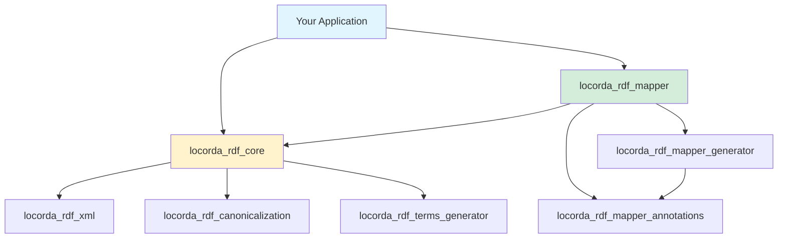

# Locorda RDF Suite

[](LICENSE)
[](CHANGELOG.md)

> **A comprehensive Dart ecosystem for working with RDF (Resource Description Framework) and Semantic Web technologies.**

The Locorda RDF Suite provides everything you need to work with RDF data in Dart—from low-level graph manipulation to high-level object mapping, with full support for multiple serialization formats and W3C standards.

## 🌟 Why Locorda RDF?

- **🎯 Complete Ecosystem** - Everything you need for RDF in one place
- **🔒 Type-Safe** - Fully typed API for compile-time safety
- **⚡ High Performance** - Optimized for speed and memory efficiency
- **📦 Zero Dependencies** - Core library has no external dependencies (except logging)
- **🎨 Modern API** - Clean, fluent interfaces following Dart best practices
- **🔧 Code Generation** - Generate mappers automatically from annotations
- **✅ Standards Compliant** - Full W3C RDF 1.1 specification support

---

## 📦 Packages

The suite consists of 7 packages organized by functionality:

| Package | Version | Description |
|---------|---------|-------------|
| [**locorda_rdf_core**](packages/locorda_rdf_core) | 0.11.0-dev | Core RDF graph classes and serialization (Turtle, JSON-LD, N-Triples, N-Quads) |
| [**locorda_rdf_mapper**](packages/locorda_rdf_mapper) | 0.11.0-dev | Bidirectional mapping between Dart objects and RDF graphs |
| [**locorda_rdf_mapper_annotations**](packages/locorda_rdf_mapper_annotations) | 0.11.0-dev | Annotations for declarative RDF mapping |
| [**locorda_rdf_mapper_generator**](packages/locorda_rdf_mapper_generator) | 0.11.0-dev | Code generator for automatic mapper creation |
| [**locorda_rdf_xml**](packages/locorda_rdf_xml) | 0.11.0-dev | RDF/XML format encoder and decoder |
| [**locorda_rdf_canonicalization**](packages/locorda_rdf_canonicalization) | 0.11.0-dev | RDF Dataset Canonicalization (RDF-CANON) and isomorphism testing |
| [**locorda_rdf_terms_generator**](packages/locorda_rdf_terms_generator) | 0.11.0-dev | Generate type-safe Dart code from RDF vocabularies |

---

## 🚀 Quick Start

### Working with RDF Graphs

```dart
import 'package:locorda_rdf_core/core.dart';

void main() {
  // Parse Turtle data
  final turtleString = '''
    @prefix foaf: <http://xmlns.com/foaf/0.1/> .
    <http://example.org/john> foaf:name "John Doe" ; foaf:age 30 .
  ''';
  
  final graph = turtle.decode(turtleString);
  
  // Query the graph
  final nameTriples = graph.findTriples(
    subject: const IriTerm('http://example.org/john'),
    predicate: const IriTerm('http://xmlns.com/foaf/0.1/name')
  );
  
  print('Name: ${(nameTriples.first.object as LiteralTerm).value}');
  
  // Encode to JSON-LD
  print(jsonldGraph.encode(graph));
}
```

### Object Mapping with Code Generation

```dart
// 1. Define your model with annotations
import 'package:locorda_rdf_mapper_annotations/annotations.dart';
import 'package:locorda_rdf_terms_schema/schema.dart';

@RdfGlobalResource(
  SchemaPerson.classIri,
  IriStrategy('http://example.org/person/{id}')
)
class Person {
  @RdfIriPart('id')
  final String id;
  
  @RdfProperty(SchemaPerson.name)
  final String name;
  
  @RdfProperty(SchemaPerson.age)
  final int age;
  
  Person({required this.id, required this.name, required this.age});
}

// 2. Generate mappers
// $ dart run build_runner build

// 3. Use the generated mapper
import 'locorda_rdf_mapper.g.dart';

void main() {
  final mapper = initRdfMapper();
  
  final person = Person(id: '123', name: 'Alice', age: 30);
  final turtle = mapper.encodeObject(person);
  
  final decoded = mapper.decodeObject<Person>(turtle);
  print('${decoded.name} is ${decoded.age} years old');
}
```

### Graph Canonicalization

```dart
import 'package:locorda_rdf_canonicalization/canonicalization.dart';
import 'package:locorda_rdf_core/core.dart';

void main() {
  // Two graphs with different blank node labels but same structure
  final graph1 = nquads.decode('_:a <http://ex.org/name> "Alice" .');
  final graph2 = nquads.decode('_:b <http://ex.org/name> "Alice" .');
  
  // Test semantic equivalence
  if (isIsomorphic(graph1, graph2)) {
    print('Graphs are semantically identical!');
  }
  
  // Get canonical form
  final canonical = canonicalize(graph1);
  print(canonical);
}
```

---

## 🎯 Use Cases

### Semantic Web Applications
Build applications that understand and process linked data:
- Knowledge graphs and ontologies
- Data integration from multiple sources
- Semantic search and reasoning

### Data Interoperability
Exchange data using open web standards:
- Schema.org markup for SEO
- FOAF profiles for social networks
- Dublin Core metadata

### Solid and Decentralized Apps
Build Solid pods and decentralized applications:
- WebID authentication
- Personal data pods
- Linked data notifications

### Digital Signatures & Verification
Ensure data integrity with canonical forms:
- Sign RDF datasets deterministically
- Verify semantic equivalence
- Deduplicate RDF data

---

## 🏗️ Architecture



**Core Foundation**: `locorda_rdf_core` provides the fundamental RDF data structures and serialization

**Object Mapping**: `locorda_rdf_mapper` ecosystem transforms between Dart objects and RDF

**Extensions**: Additional packages add format support, canonicalization, and code generation

---

## 📚 Documentation

Each package has comprehensive documentation:

- [**locorda_rdf_core**](https://locorda.dev/rdf/core) - Getting started, cookbook, design philosophy
- [**locorda_rdf_mapper**](https://locorda.dev/rdf/mapper) - Mapping guide, collection strategies, examples
- [**locorda_rdf_mapper_annotations**](https://locorda.dev/rdf/mapper/annotations) - Annotation reference, IRI strategies
- [**locorda_rdf_mapper_generator**](https://locorda.dev/rdf/mapper/generator) - Code generation workflow
- [**locorda_rdf_xml**](https://locorda.dev/rdf/xml) - RDF/XML format guide
- [**locorda_rdf_canonicalization**](https://locorda.dev/rdf/canonicalization) - Canonicalization & isomorphism
- [**locorda_rdf_terms_generator**](https://locorda.dev/rdf/terms-generator) - Vocabulary code generation

---

## 🔧 Development

This is a Melos-managed monorepo. Common commands:

```bash
# Install dependencies for all packages
melos bootstrap

# Run tests across all packages
melos run test

# Run analyzer on all packages
melos run analyze

# Format code across all packages
melos run format

# Version and publish packages
melos version
```

### Contributing

Contributions are welcome! Please see [CONTRIBUTING.md](CONTRIBUTING.md) for guidelines.

1. Fork the repository
2. Create a feature branch
3. Make your changes
4. Run `melos run test` and `melos run analyze`
5. Submit a pull request

---

## 📊 Standards & Specifications

This suite implements the following W3C standards:

- [RDF 1.1 Concepts and Abstract Syntax](https://www.w3.org/TR/rdf11-concepts/)
- [RDF 1.1 Turtle](https://www.w3.org/TR/turtle/)
- [RDF 1.1 N-Triples](https://www.w3.org/TR/n-triples/)
- [RDF 1.1 N-Quads](https://www.w3.org/TR/n-quads/)
- [JSON-LD 1.1](https://www.w3.org/TR/json-ld11/)
- [RDF/XML Syntax](https://www.w3.org/TR/rdf-syntax-grammar/)
- [RDF Dataset Canonicalization](https://www.w3.org/TR/rdf-canon/)

---

## 🛣️ Roadmap

### Upcoming Features
- **RDF 1.2 / RDF-star** support
- **SHACL** validation
- **SPARQL** query support
- **Streaming** operations for large datasets
- **JSON-LD** framing and compaction improvements

### Under Consideration
- GraphQL integration
- OWL reasoning support
- N3 / Notation3 format
- Triple pattern fragments

---

## 🤝 Community

- **Issues**: [GitHub Issues](https://github.com/locorda/rdf/issues)
- **Discussions**: [GitHub Discussions](https://github.com/locorda/rdf/discussions)
- **Website**: [locorda.dev/rdf](https://locorda.dev/rdf)

---

## 📜 License

All packages in this suite are licensed under the **MIT License** - see the [LICENSE](LICENSE) file for details.

---

## 🤖 AI Policy

This project is proudly **human-led and human-controlled**, with all key decisions, design, and code reviews made by people. At the same time, it stands on the shoulders of LLM giants: generative AI tools are used throughout the development process to accelerate iteration, inspire new ideas, and improve documentation quality. We believe that combining human expertise with the best of AI leads to higher-quality, more innovative open source software.

---

<div align="center">

**Built with ❤️ by the Locorda team**

© 2025-2026 Klas Kalaß. All rights reserved.

</div>
